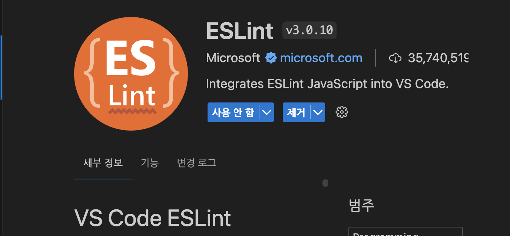
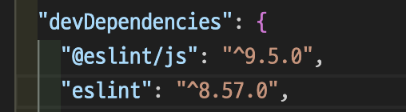
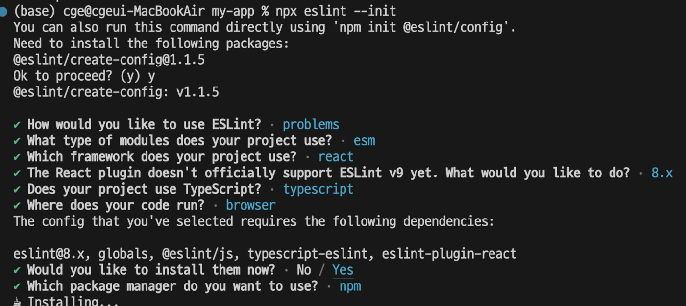

[eslint-config-airbnb](https://www.npmjs.com/package/eslint-config-airbnb)와 [eslint-config-airbnb-typescript](https://www.npmjs.com/package/eslint-config-airbnb-typescript)를 기준으로 진행해보겠습니다!

# ESLint 란?

> ESLint statically analyzes your code to quickly find problems. It is built into most text editors and you can run ESLint as part of your continuous integration pipeline. <br>( ESLint는 코드를 **정적으로 분석**하여 문제를 빠르게 찾아낸다. 대부분의 텍스트 에디터에 내장되어 있으며 연속적인 통합 파이프라인의 일부로 ESLint를 실행할 수 있다. )

뭔말인고 하니 ESLint를 사용하면 프로젝트에서 **코드를 작성하는 방식을 일관성이 있는 방식**으로 구현할 수 있도록 도와준다!
예를 들면, 함수를 정의할 때, function 키워드를 사용할지, arrow를 사용할지, 아니면 타입을 무조건 지정해줘야하는지 코드의 탭, 한줄 당 최대 길이는 얼마인지 등등 일관성이 있는 코드를 작성하도록 도와줍니다.

# Prerequisites

SSL이 있는 Node.js (^18.18.0, ^20.9.0, or >=21.1.0)가 설치되어있어야한다. (Node.js에 SSL 설치되어있음.)

# 설치 방법

1. ESLint Extention을 설치한다.
   

2. 프로젝트 내에서 개발 환경에서 ESLint를 의존 추가한다.
   -D 옵션을 추가하면 devDependencies에 패키지들이 추가된다!
   
   `npm install -D eslint # npm`

3. 기본 세팅 해준다.
   `npx eslint --init`
   

4. airbnb 설정 넣기!
   `npx install-peerdeps --dev eslint-config-airbnb`
   위 명령어를 통해 필요한 설정들을 다운받아준다.
   .eslintrc 파일에 `"extends": ["airbnb", "airbnb/hooks"]`를 추가해준다.

5. airbnb-typescript 설정 넣기

`npm install -D eslint-config-airbnb-typescript`

> @typescript-eslint/eslint-plugin 과 @typescript-eslint/parser 도 install하라고 나오지만 앞선 설정들로 인해 이미 다운받았기 때문에 필요없다.
> 마찬가지로 아래와같이 추가해준다.

```
    {
    extends: ['airbnb', 'airbnb-typescript'],
     parserOptions: {
       project: './tsconfig.json'
     }
    }
```

# 사용법

- ESLint는 프로젝트 코드 단에서 사용하는게 아니라, VSCode, WebStorm과 같은 Editor(IDEA)에서 적용해서 사용한다.

- 설치 후에 'eslint.config.mjs' 파일이 생길 것이다!

```
import globals from "globals";
import pluginJs from "@eslint/js";
import tseslint from "typescript-eslint";
import pluginReactConfig from "eslint-plugin-react/configs/recommended.js";

export default [
  // ESLint가 검사할 파일의 패턴 정의
  { files: ["**/*.{js,mjs,cjs,ts,jsx,tsx}"] },
  // ESLint의 파서 옵션 정의. JSX 구문 지원하도록 설정되어있음.
  { languageOptions: { parserOptions: { ecmaFeatures: { jsx: true } } } },
  { languageOptions: { globals: globals.browser } },
  pluginJs.configs.recommended, // 기본 JS linting 규칙을 포함한다.
  ...tseslint.configs.recommended, // TS linting 규칙 포함
  pluginReactConfig, // React linting 규칙 포함
];
```

> parser : 구문 분석
> linting : 코드 작성할 때 규약을 자동으로 맞춰주는 도구

# 후기

내가 이해한 바로는 eslint는 버그를 적은 노력으로 미연에 방지하기 위해서 사용하는 것 같다. 정적 분석이기 때문에 코드의 실행이 필요 없으므로 동적 테스트보다 이른 시점에 버그를 찾아낼 수 있기 때문에 사용 하는 듯...
이걸 왜하노싶었는데 그래도 정리해보니까 이게 뭔지, 하면 좋네 싶다ㅎㅎ...;
다음 시간에는 prettier에 대해 알아보고 eslint와 prettier를 동시에 사용할 경우 일어나는 충돌을 해결하는 법에 대해 알아봐야겠다!

# 참고

    [ESLint 공식 홈페이지](https://eslint.org/)
